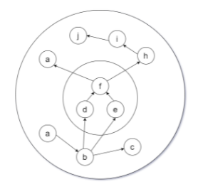
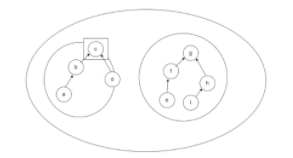
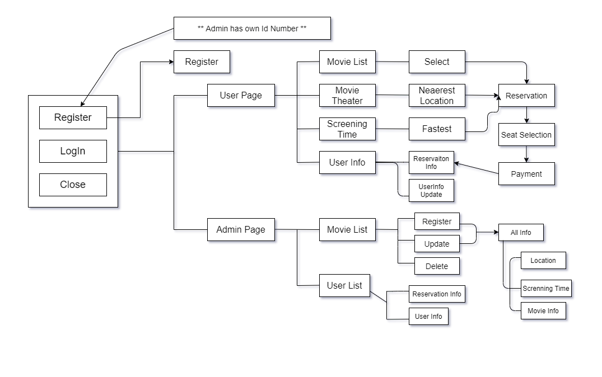
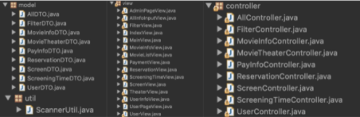
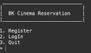

# 영화 예매 프로그램
---
## [Java.console] 

---
- 요약: MVC패턴을 활용하여 영화예매 프로그램을 Console로 구현

- Code Source: https://github.com/bkk91/movieReservation 

- 언어: Java 

- 통합 개발 환경(IDE) : Eclipse (ver. 2021.03)

- 내용: 비트컴퓨터 국비 교육과정에서 처음으로 프로그래밍 언어 Java를 배우고 Console프로그램으로 프로그래밍 설계와 객체지향의 의미를 이해하고 구현하기 위해서 영화 예매 프로그램 (Movie Ticket Booking Program)을 프로그래밍.

---
### 프로젝트 플랜 (Project plan)

 <b> 1. 개요 (Outline) </b> 

 
- 해당 프로그램은 사용자가 영화 예매를 하기 위한 프로그램으로서 관리자 및 사용자의 회원가입, 로그인 과정을 포함하고 영화의 정보와 상영시간 및 상영관의 위치를 제공해주는 기능과 함께 사용자가 결제를 할 수 있도록 도와주는 온라인 상의 영화 예매 기능을 console로 구현한 프로그램이다.

 

 <b> 2. 분석 (Analysis) </b> 

 

- MVC 모델을 활용하여 각기 필요한 객체를 구분하여 제어하고 구현한다.

- MVC 모델을 효과적으로 활용하기 위하여 집합론의 상한과 하한, 상계와 하계의 개념을 통하여 컨트롤러 뷰어의 의존성 주입을 최소한으로 사용하는 과정을 거친다. 또한 이 과정에서 전순서집합을 정의하여 쇄의 역할을 각각 수행하도록 한다.

- MVC 모델은 결정론적인 특성에 의하여 부분순서집합이라 정의할 수 있고 부분순서집합 Controller(A)의 부분순서집합 Viewer(B)에 대한 supB와 infB를 정의하여 순서보존함수를 만들고, 이들의 “순서동형”을 활용하여 효과적인 Architecting을 한다. 여기서 순서보존함수의 쇄(chain)은 각 Method를 의미한다.

※ 아래에서 추가적인 설명

- View 구조에서 각 객체와 메소드들의 집합군을 어떠한 교집합을 통하여 나타내야 하는지에 대한 개념정리를 위하여 집합론의 전순서집합을 사용하였고, 다음과 같다.

- 전체 프로그램을 전순서집합, 각 view를 부분순서 집합으로 나타내고 상계 하계를 분리 한 후 각각의 상계를 하나의 view로 구현했다.

- 예를 들어 우측의 figure에서 각 원소 a->b->c를 하나의 메소드(부분순서함수)로 정의하고 원소 {c} 는 {a,d}에 대한 상계, {a,d}는 {c}에 대한 하계라 한다. 이 때 {c} (상계)를 하나의 view로 나타내며, 전체적으로 c,g는 프로그램 내의 각각 view를 나타낸다.

 

 <b> 3. 디자인 (Design) </b> 

 
##### 3.1 기능도 (Structure) 

###### 핵심기능

- 아이디 등록(Register): User input data in format

- 로그인(LogIn): Id/password checking

- 각 Id에 저장된 데이터 입출력(Input/Output data): All DTO has each Id number.- By using ModelDTO IdNumber, respectively.

- 예약(Reservation): 영화이름으로 선택(select by MovieList)- 영화관의 가까운 위치로 선택(select by theater location; which one is the closest one?)- 현재시간 기준으로 빠른 영화 선택(select by screening time; which one is the fastest one?)

- 좌석선택(Seat selection): 알고리즘   > 행/열로 예약전에 모두 "O"로 표시 하고 예약시 "X"로 변환   > 이 정보는 예약정보에 저장되어 유저id에 따라 각각 저장되어 위에 언급한 3의 기능을 수행.

###### Model

- Set A: User = {id, name, password, nickname, address, phone#, creditcard#, grade}
- Set B: Movie Info = {id, name, running time, evaluation, summary}
- Set C: Movie Theater(location) = {id, location}
- Set D: Screen Info = {id, number of screens}
- Set E: Screening Time(related to current time) = {currenttime, timeid}
- Set F: Reservation = {id, seat column, seat row, seat total}
- Set G: PayInfo ArrayList = {id}

###### Controller

Model DTO에 명령을 보냄으로써 CRUD 기능 구현.

- Set A(User)    
- Set B(Movie Information)   
- Set C(Movie Theater: location)   
- Set D(Screen Information)   
- Set E(Screen Time)   
- Set F(Reservation)   
- Set G(Payment)

 

 <b> 4. 구현 (Embody) </b> 

 
 

 <b> 5. 수행 (Test) </b> 

 

 

 

 <b> 6. 평가 (Evaluation) </b> 

 
- Java Eclipse를 활용하여 만들어본 첫 콘솔 프로그램(MTBP)인 까닭에 계획했던 시간보다 지체되어 완성하였다. (1주 ->2주)

- 실제 구현은 생각했던 설계와 어긋나는 부분이 있었다.  

- 첫번째는 관리자가 등록한 정보를 사용자가 원하는 영화, 지역, 시간에 따라 각각 필터링 해주어 조건안에 1개라도 속해 있으면,

- 추출해주는 기능 알고리즘에 실제로 필터(FilterDTO)를 만들어 매칭해주는 역할을 해야한다는 것이었고,

- 두번째는 등록 정보에 대한 전체(ALLDTO)를 추가하여 한번더 관리해주는것이 조금 더 기능 수행에 용이할거 같아 추가하였다.

- 여기서 의문은 Data transfer 하는 부분에 있어 외부 DB를 사용하지 않고 콘솔 내에서 해결해야 하다보니 DTO를 추가하게 된 것인가, 

- 혹은 DB를 끌어다 사용하더라도 이러한 문제가 발생할 것인가에 대한 생각인데 추후에 SQL공부를 하며 정리해 보아야겠다.

- 두번째는 외부에서 DB의 입출력을 담당하는 역할을 하는 class 들을 package에 선언하였지만,

- 처음 생각보다 비효율적인 방법이라 controller 의 생성자에 더미 값을 생성하여 사용하였다. 

- SQLD/SQLP에 대한 공부를 시작하였는데 위의 문제와 마찬가지로 추후에 oracle 11g DB를 사용하여 다시한번 작업해보아야겠다.

- 골치아팠던 점은 시간을 상당히 투자했음에도 불구하고 잘못된 초기 설계로 인하여 두번이나 처음부터 다시 작업을 시작하여야 했다.

- 특히나, 잘못된 parameter를 선언하거나 의존성주입을 하지 않아 해당 정보를 불러오지 못하는 null오류로 인하여 골치가 아팠다.

- 코딩을 치는것도 중요하지만 설계부분에 있어서 변수의 선언과 분류의 가치를 깨달았다.

- 단순히 수학의 연장선이라고 생각하여 쉽게 접근했지만, 알고리즘을 코딩하는데 있어서 나의 생각만큼 자유로이 코딩 할 수 없었다.

- 자바 언어에 익숙해지면 나아질 부분이라 생각하고 다음 프로젝트를 준비하는 밑바탕으로 삼아야겠다.

 

---
